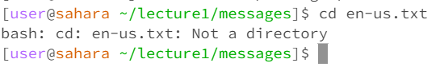

# Lab Report 1

## `cd`

  
Initial working directory: `~/lecture1`  
Working directory after: `~/`  
Running `cd` with no arguments resulted in the current working directory being switched to the root directory. This is not an error, moreso just a feature of the `cd` command, as running `cd` without arguments is essentially equivalent to running `cd ~`, which switches to the root directory as expected.

 

  
Initial working directory: `~/`  
Working directory after: `~/lecture1/messages/`  
Running `cd` with a relative path to a directory as an argument resulted in the current working directory being switched to the requested path. This is expected behavior for `cd`; it didn't print any output and successfully switched the working directed to the requested path (relative to the current working directory). No errors present.

 

  
Initial working directory: `~/lecture1/messages/`  
Working directory after: `~/lecture1/messages/`  
Running `cd` with a path to a file resulted in failed execution of the command, not switching the current working directory. This is because the command's usage is to change the current working directory to that of a new directory; attempting to change the directory into a file will result in an error, as an individual file cannot act as a directory. The error raised by the command line when attempting to run `cd` this way reflects this.

## `ls`

  
Initial working directory: `~/lecture1/messages/`  
Running `ls` with no arguments produced a list of all files and directories within the current working directory, as not specifying a path or directory to run `ls` in defaults to running in the current working directory. No errors present and produced the expected result.

 

  
Initial working directory: `~/`  
Running `ls` with a relative path to a directory produces a list of all files and directory within that specified directory. This is because providing an actual directory path to `ls` causes it to print a list within that directory instead of the current working directory. The current working directory doesn't actually change, but `ls` acts on the path requested instead of the current path. No errors present and produced the expected result.

 

  
Initial working directory: `~/`  
Running `ls` with a path to a file just results in the relative path of that file. This is because `ls` expects a directory as an argument so that it can list all of the files in it; passing in a filepath as an argument causes `ls` to not execute as intended, and instead it simply displays information about the file - in this case, it just displays its path relative to the current working directory. This is not necessarily an error, just the way the `ls` command functions when given a filepath instead of a directory.

## `cat`

  
Initial working directory: `~/lecture1/messages/`  
Running `cat` with no arguments results just in an input field where the command line prints back out whatever is typed in. This is because `cat` expects a file to read, and when no argument is passed in, it simply reads and returns user input instead of an existing file. This is not an explicit error.

 

  
Initial working directory: `~/lecture1/`  
Running `cat` on a path to a directory results in failed execution of the command and an error being raised by the command line. This is because the `cat` command is intended to read the contents of a file or multiple files, not of an entire directory. Attempting to pass in a directory into this command results in the error printed by the command line and no other output.

 

  
Initial working directory: `~/`  
Running `cat` on a path to a file prints out all of the contents of the file into the command line. This is the intended usage and expected result of the `cat` command; calling `cat` on a file or a sequence of files will produce concacenated output in the command line that prints the contents of all files involved, as can be seen in this command execution. No errors are present.
