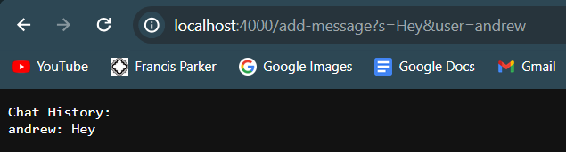

#Lab Report 2

##Part 1: Full Chat Server Code:
```
import java.io.IOException;
import java.net.URI;

class Handler implements URLHandler {
    
    String chatHistory = "";
    public String handleRequest(URI url) {
        if (url.getPath().equals("/")) {
            if(chatHistory.equals("")){
                return "No messages yet";
            }else{
                return "Chat History:\n" +chatHistory;
            }
        }else{
            String[] arguments = url.getQuery().split("&");
            String[] param1 = arguments[0].split("=");
            String[] param2 = arguments[1].split("=");
            chatHistory += (param2[1]+": "+param1[1]+"\n");
            return "Added message\nChat History:\n" + chatHistory;
        }
        }
    }
    
class ChatServer {
    public static void main(String[] args) throws IOException {
        if(args.length == 0){
            System.out.println("Missing port number! Try any number between 1024 to 49151");
            return;
        }

        int port = Integer.parseInt(args[0]);

        Server.start(port, new Handler());
    }
}

```
<br>

 <br>
When these arguments are passed into the local server URL, methods are first called in the provided Server.java class (not included above because I didn't write it) that passes the URL through to the Handler class above, calling the `handleRequest()` method with the argument "http://localhost:4000/add-message?s=Hey&user=andrew". `handleRequest()` then executes the `else` block, calling `getQuery()` to isolate the query section of the URL (i.e. everything after the question mark). The message and user parts are then further isolated and concatenated onto the `chatHistory` field, which is displayed on the server. The only field that's changed by this request is `chatHistory` (and technically the `URI url` parameter but is not a field within the method itself). 

<br>

 <br>
For this second example, all the routes and method calls are exactly the same as from the first example, except `handleRequest()` receives a different argument, that being "http://localhost:4000/add-message?s=What's up&user=Professor Politz". The else block is still triggered, and `getQuery` still isolates the URL until the desired elements are concacenated onto `chatHistory`. Again, `chatHistory` is the only field that is changed by this request, just by a different argument than the first instance of add-message.

<br>

#Part 2

Private key path: <br>
 <br>

Public key path (on ieng6): <br>
 <br>

Logging in without password: <br>
 <br>

#Part 3

Learnig how to connect to a remote computer last week through just the terminal was really cool, and something I had no idea how to do before. Even more interesting was how we set up the no-password login this week, learning about the scp command and copying keys generated on our own computer onto remote computers. I also learned a lot more about URLs and their structure, specifically about fragments, which we didn't talk about that much but was something I had always wondered about URLs. Overall, I learned a ton about how to navigate the command line and how to work with remote computers, as well as how to manipulate and process URLs to pass in appropriate information to programs. 


