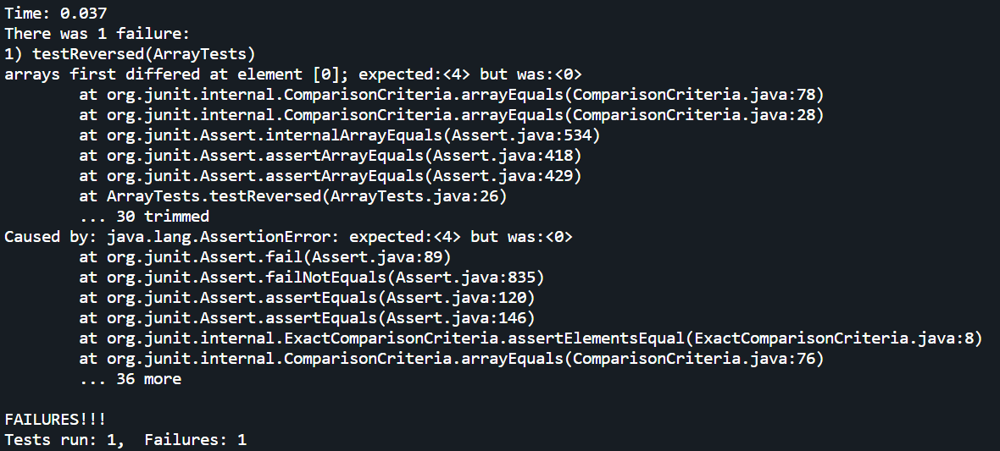
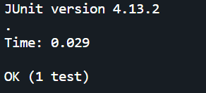

# Lab Report 3

## Part 1 - Bugs

Bug in method `reversed()`: <br>

- ## Failure inducing input:

```
  public void testReversed() {
    int[] input2 = {1, 2, 3, 4};
    assertArrayEquals(new int[]{4, 3, 2, 1},
        ArrayExamples.reversed(input2));
}
```

- ## Input that does not induce failure:

```
  public void testReversed() {
    int[] input1 = { };
    assertArrayEquals(new int[]{},
        ArrayExamples.reversed(input1));
  }
```

- ## Symptom

  

- ## Bug <br>
  Original code:

```
  static int[] reversed(int[] arr) {
    int[] newArray = new int[arr.length];
    for(int i = 0; i < arr.length; i += 1) {
      arr[i] = newArray[arr.length - i - 1];
    }
    return arr;
  }
```

This code causes unexpected output because on line 4, we are assining values to the original array from the new array when it should be the other way around; for the reversal to work as expected, we need to assign values to the new array going backward from the input array, like so:

```
 static int[] reversed(int[] arr) {
    int[] newArray = new int[arr.length];
    for(int i = 0; i < arr.length; i += 1) {
      newArray[i] = arr[arr.length - i - 1];
    }
    return newArray;
  }
```

Simply switching `arr` and `newArray` in line 4 (and returning `newArray`) fixes the bug, as we have resolved the issue of values being assigned to the original array instead of the new one. With this change, values are now pulled from the original array (indexing backwards) and assigned to the new array. <br>

If we run the tests again, we'll see that the neither of inputs shown previously will no longer induce any errors: <br>


## Part 2 - Researching Commands: grep

- -c: count of times a pattern appears for every specified file

```
andrewyz@DESKTOP-IH649LH:~/docsearch/technical$ grep -c -r "successful" | head -n 20
government/Media/Terrorist_Attack.txt:2
government/Media/Domestic_violence_aid.txt:0
government/Media/fight_domestic_abuse.txt:0
government/Media/Entities_Merge.txt:0
government/Media/Free_legal_service.txt:0
government/Media/Philly_Lawyers.txt:0
government/Media/Making_a_case.txt:1
government/Media/Legal_system_fails_poor.txt:0
government/Media/Barnes_new_job.txt:1
government/Media/defend_yourself.txt:0
government/Media/Wingates_winds.txt:0
government/Media/City_Council_Budget.txt:0
government/Media/BusinessWire2.txt:0
government/Media/Legal_services_for_poor.txt:0
government/Media/Funds_Shortage.txt:0
government/Media/Butler_Co_attorneys.txt:0
government/Media/Ginny_Kilgore.txt:0
government/Media/Court_Keeps_Judge_From.txt:0
government/Media/GreensburgDailyNews.txt:0
government/Media/AP_LawSchoolDebts.txt:0
```

The -c option displays each file and the number of times that the search parameter occurs within that file.
This particular command is showing the first 20 files, and we can see the files that contain the word and the number of times it appears in them. We can make this a bit more useful though:

```
andrewyz@DESKTOP-IH649LH:~/docsearch/technical$  grep -c -r "successful" | sort -t ":" -k 2 -n | tail -n 10
government/Gen_Account_Office/Testimony_Jul17-2002_d02957t.txt:9
911report/chapter-3.txt:10
biomed/1471-2164-4-23.txt:13
government/Alcohol_Problems/Session3-PDF.txt:13
government/Gen_Account_Office/ai00134.txt:13
government/About_LSC/State_Planning_Report.txt:20
government/Gen_Account_Office/gg96118.txt:20
government/Gen_Account_Office/d01376g.txt:25
government/Gen_Account_Office/Sept27-2002_d02966.txt:27
government/Gen_Account_Office/d02701.txt:30
```

By isolating and sorting the results, we get a list of the top 10 documents that match the specified query the most amount of times, as well as that specific count. This is super useful if we're looking for specific documents that may be more relevant to a phrase that we're looking for.

- -l: displays only filenames that contain the pattern

```
andrewyz@DESKTOP-IH649LH:~/docsearch/technical$ grep -l -r "successful" | head -n 20
government/Media/Terrorist_Attack.txt
government/Media/Making_a_case.txt
government/Media/Barnes_new_job.txt
government/Media/Assuring_Underprivileged.txt
government/Media/Service_Agency.txt
government/Media/Nonprofit_Buys.txt
government/Media/BergenCountyRecord.txt
government/Media/Helping_Out.txt
government/Media/Poverty_Lawyers.txt
government/Media/Politician_Practices.txt
government/Media/Hard_to_Get.txt
government/Env_Prot_Agen/ctm4-10.txt
government/Env_Prot_Agen/final.txt
government/Env_Prot_Agen/ctf7-10.txt
government/Env_Prot_Agen/ro_clear_skies_book.txt
government/Env_Prot_Agen/nov1.txt
government/Env_Prot_Agen/bill.txt
government/Env_Prot_Agen/multi102902.txt
government/Env_Prot_Agen/jeffordslieberm.txt
government/About_LSC/State_Planning_Report.txt
```

The -l prints only the names of the files that contain instances of the requested query. This above command
shows 20 files that are guaranteed to contain at least 1 match to the requested word. Again though, we
can make this slightly more useful:

```
andrewyz@DESKTOP-IH649LH:~/docsearch/technical$ grep -l -r "successful" | xargs grep -c "successful" | sort -t ":" -k 2 -n | head -n 10
911report/chapter-10.txt:1
911report/chapter-13.3.txt:1
911report/chapter-8.txt:1
biomed/1468-6708-3-4.txt:1
biomed/1471-2091-3-17.txt:1
biomed/1471-2105-2-8.txt:1
biomed/1471-2105-3-2.txt:1
biomed/1471-2105-3-3.txt:1
biomed/1471-2105-3-38.txt:1
biomed/1471-2105-3-4.txt:1
```

By combining the -l option with the -c option, we guarantee that any input to -c contains at least 1
match. This way, we can sort and display the 10 files with the least reference that are NOT 0. In other words,
we find the files that do contain the match in some capacity, but mention it least frequently (which is useful
in some obscure scenario I'm sure!)

- -n: displays the line numbers of the matched lines

```
andrewyz@DESKTOP-IH649LH:~/docsearch/technical$ grep -n -r "successful" | head -n 20
government/Media/Terrorist_Attack.txt:103:are to be successful.
government/Media/Terrorist_Attack.txt:109:"For every 200 successful [alternative exam] takers, the courts
government/Media/Making_a_case.txt:81:essential to representing yourself successfully. Adams recommended
government/Media/Barnes_new_job.txt:64:country's most successful law firms has increased by more than 50
government/Media/Assuring_Underprivileged.txt:158:successfully argued against its proposed elimination of the Public
government/Media/Service_Agency.txt:42:right to due process and a fair hearing, the first successful
government/Media/Nonprofit_Buys.txt:78:If the model is successful in Oxnard, it may be used at other
government/Media/BergenCountyRecord.txt:95:Thorne also argued successfully before the state Supreme Court
government/Media/Helping_Out.txt:59:children. It has been called the nation's most successful
government/Media/Poverty_Lawyers.txt:120:LLP. Father and son made a successful appeal before a Social
government/Media/Politician_Practices.txt:27:lawyer -- having built a hugely successful trial practice in
government/Media/Politician_Practices.txt:67:decade, the average revenue of the country's most successful firms
government/Media/Hard_to_Get.txt:68:cold, hard reality, though, and every case closed successfully
government/Env_Prot_Agen/ctm4-10.txt:1544:6 Houston Laboratory has successfully used HW MARINEMIX® sea salts
government/Env_Prot_Agen/ctm4-10.txt:1548:successfully to culture and maintain the mysid brood stock and
government/Env_Prot_Agen/ctm4-10.txt:1645:One successful method used is a thermostatically controlled heat
government/Env_Prot_Agen/ctm4-10.txt:1970:Subsection 8.5. If shipping problems (e.g., unsuccessful Saturday
government/Env_Prot_Agen/final.txt:28:similar to the successful Acid Rain Program established by the 1990
government/Env_Prot_Agen/final.txt:275:successful tool in reducing these emissions. However, while we are
government/Env_Prot_Agen/ctf7-10.txt:554:Subsection 8.5. If shipping problems (e.g., unsuccessful Saturday
```

This is a pretty straightforward option that displays the line number of the file that the requested
query appears in. This is very useful for obvious reasons; if someone wants to get to the specific part
of a document that the requested query appears in, this option is perfect. We can combine this with the
sorting from earlier for a useful result:

```
andrewyz@DESKTOP-IH649LH:~/docsearch/technical$ grep -c -r "successful" | sort -t ":" -k 2 -n | tail -n 1 | cut -d ":" -f 1 | xargs grep -n "successful"
199:successful outcomes. The first knowledge point occurs when the
222:probability of successful cost and schedule outcomes. Problems
257:control before committing to full production. The more successful
332:companies had more successful outcomes. For example, the AIM-9X and
418:DOD programs that had more successful outcomes used key best
430:On the other hand, DOD programs with less successful outcomes
460:facilitate better decisions and more successful acquisition program
535:process, specifically product development and ways to successfully
600:points 2 and 3, particularly at how successful companies design and
609:have successful cost and schedule outcomes. Programs that do not
673:that have led to more successful product development and production
682:practices that resulted in successful product development. We
706:turbines, derived from its successful jet engine programs, for
850:considered them to be in two basic categories-successful and
851:unsuccessful cost and schedule performance outcomes. This basis for
943:We found that the most successful programs had taken steps to
955:validated before committing to production. The most successful DOD
966:successful cases had captured. They increased investments in
1004:basis, we believe other factors contributed to a successful
1086:processes than more successful cases. For example, at its limited
1111:successful programs that the product can be manufactured within
1123:Leading commercial companies have been successful in achieving
1166:had relatively successful outcomes. The other DOD
1233:more successfully and cost-effectively develop new, but
1243:had relatively successful cost and schedule outcomes. They
1526:making the prototypes a key ingredient to successful outcomes.
1813:successful production outcome to date. Program officials took steps
2035:successful acquisition program outcomes. As demonstrated by
2036:successful companies, using these criteria can help ensure that the
2367:measure design stability and process controls. Third, successful
```

By using -n on the file that we know contains the most amount of mentions of the query,
we can get a comprehensive list of every time that query appears and the line that it appears at.
This is super helpful for finding out exactly where and why the document uses the requested phrase so often.

- -L: shows all files that do NOT match the pattern

```
andrewyz@DESKTOP-IH649LH:~/docsearch/technical$ grep -r -L "the"
andrewyz@DESKTOP-IH649LH:~/docsearch/technical$
```

With the empty result from running the above command, we can see that there isn't a single document in the
entire directory that does not contain the word "the" (which I guess is to be expected). This can also be used
in an interesting way, as a profanity filter of sorts:

```
andrewyz@DESKTOP-IH649LH:~/docsearch/technical$ grep -r -L "****" | head -n 20
government/Media/Terrorist_Attack.txt
government/Media/Domestic_violence_aid.txt
government/Media/fight_domestic_abuse.txt
government/Media/Entities_Merge.txt
government/Media/Free_legal_service.txt
government/Media/Philly_Lawyers.txt
government/Media/Making_a_case.txt
government/Media/Legal_system_fails_poor.txt
government/Media/Barnes_new_job.txt
government/Media/defend_yourself.txt
government/Media/Wingates_winds.txt
government/Media/City_Council_Budget.txt
government/Media/BusinessWire2.txt
government/Media/Legal_services_for_poor.txt
government/Media/Funds_Shortage.txt
government/Media/Butler_Co_attorneys.txt
government/Media/Ginny_Kilgore.txt
government/Media/Court_Keeps_Judge_From.txt
government/Media/GreensburgDailyNews.txt
government/Media/AP_LawSchoolDebts.txt
```

I've censored the above query for obvious reasons, but just take my word that it was a not very nice
word; this option allows us to find every file that does not contain that specific profanity. Chaining this with other options to eliminate allows us to create a pretty reliable profanity filter that does not show any documents
containing words we don't want to see. <br>

Source: https://man7.org/linux/man-pages/man1/grep.1.html
