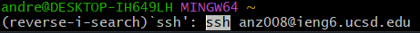
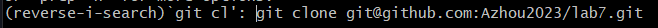
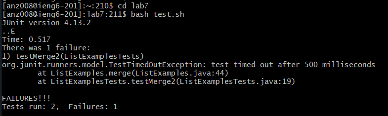
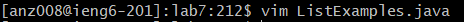
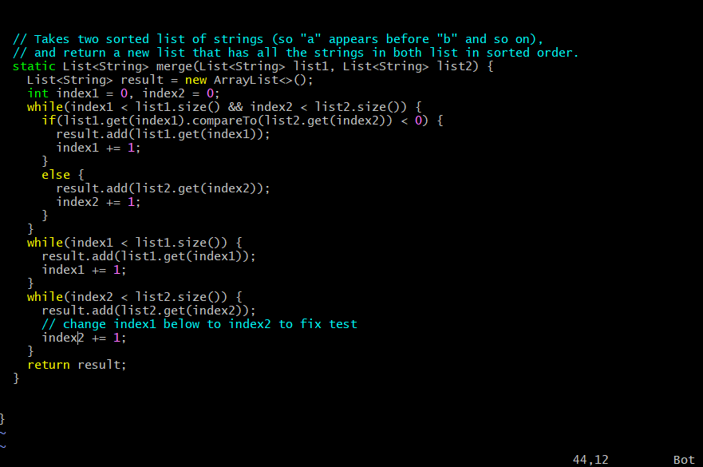
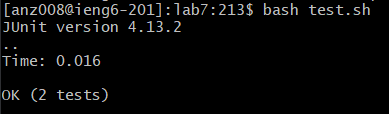
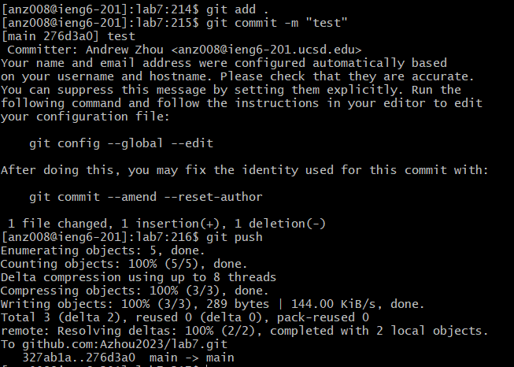

# Lab Report 3

## Step 4:

`CTRL+R`, `ssh`, `<enter>`

  
For the first step of the timed section, I first used `CTRL+R` to search for the desired command, then typed `ssh` to find the most recent `ssh` command, which was the desired connection command. I then pressed `<enter>` to run the command, completing the step of connecting to ieng6.

## Step 5:

`CTRL+R`, `git cl`, `<enter>`

  
For this cloning step, I again first used `CTRL+R` to search for the git clone command (that has the SSH url) in it by typing in just enough letters to eliminate all other possible previous git commands with `git cl`. I then pressed `<enter>` to run the command, completing the clone step.

## Step 6:

`cd lab7`, `<enter>` `bash t`, `<tab>`, `<enter>`

  
For this step, I first did `cd lab7` and `<enter>` to change the current working directory to the newly clone lab7. I then typed out `bash t` (which is the first part of `bash test.sh`) and then pressed `<tab>` to autocomplete the command, since `test.sh` is the only file in the directory to start with the letter t. I then pressed `<enter>` to run the command, completing this step.$$

## Step 7:

`vim L`, `<tab>`, `.java`, `<enter>`, `43j`, `e`, `r2`, `:wq!`,

  
  
For this step, I first typed `vim L` then `<tab>` to autocomplete the command to `vim ListExamples`, and since there's two files named `ListExamples` with different file extensions (`ListExamples.class` and `ListExamples.java`), I then manually typed `.java` to get the desired file and `<enter>` to enter the editor. Now in the vim editor, I typed `43j` to go down 43 lines, since line 44 is the line where the bug occurs. I then typed `e` to go to the end of the next word and `r2` to replace the last character of that word with the number 2, fixing the bug. I then typed `:wq!` to save the file and exit the vim editor, completing this step.

## Step 8:

`bash t`, `<tab>`, `<enter>`

  
For this step, it's essentially a repeat of step 6, except without the switching of working directories first. `bash t` + `<tab>` fills in the command to run the tests, then `<enter>` runs the command and completes the step.

## Step 9:

`git add .`, `<enter>`, `git commit -m "test"`, `<enter>`, `git push`, `<enter>`

  
This step was essentially just the pushing to GitHub routine; `git add .` staged/tracks all the files in the lab7 directory to commit, `<enter>` executes the command. `git commit -m "test"` commits the current changes with a message of "test", and `<enter>` again executes the command. Finally, `git push` pushes the local changes to GitHub, with `<enter>` once again executing the command and completing this step, as well as this entire sequence.
