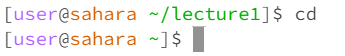
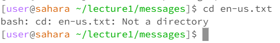

# Lab Report 1

## cd

  
Initial working directory: ~/lecture1  
Working directory after: ~/  
Running cd with no arguments resulted in the current working directory being switched to the root directory. This is not an error moreso just a feature of the cd command, as running cd without arguments is essentially equivalent to running cd ~, which switches to the root directory as expected.

   

   
Initial working directory: ~/  
Working directory after: ~/lecture1/messages/  
Running cd with a relative path to a directory as an argument resulted in the current working directory being switched to the requested path. This is expected behavior for cd; it didn't print any output and successfully switched the working directed to the requested path (relative to the current working directory). No errors present.

   

  
Initial working directory: ~/lecture1/messages/  
Working directory after: ~/lecture1/messages/  
Running cd with a path to a file resulted in failed execution of the command, not switching the current working directory. This is because the command's usage is to change the current working directory to that of a new directory; attempting to change the directory into a file will result in an error, as an individual file cannot act as a directory. The error raised by the command line when attempting to run cd this way reflects this.

## ls

## cat
